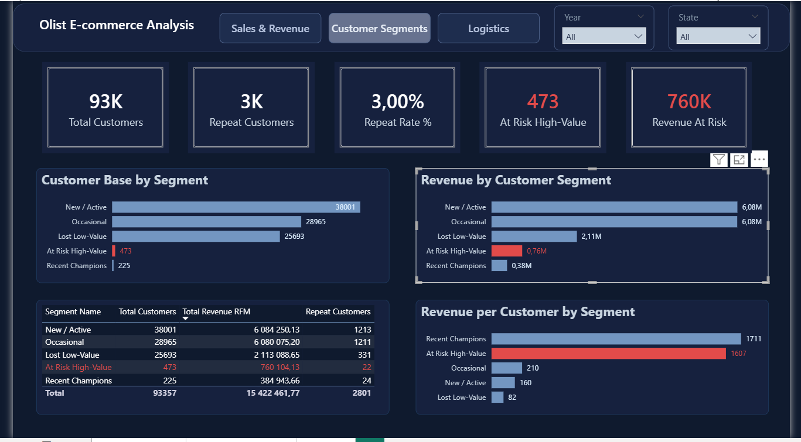
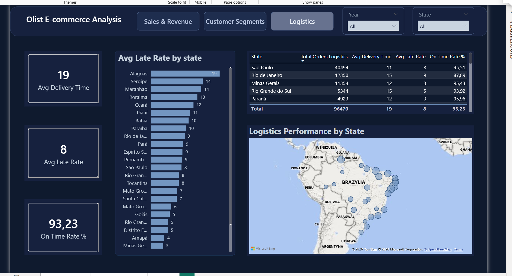

# E-commerce Analysis — Olist Brazilian Marketplace

✅ **Status: Complete**

Olist is a Brazilian marketplace platform connecting independent sellers with buyers — similar to how Allegro operates in Poland. This end-to-end project covers the full analytical pipeline: from raw data cleaning through SQL data modelling to interactive Power BI dashboards and Python analysis.

---

## 📈 Project Roadmap

| Phase | Status |
|-------|--------|
| Phase 1 — Data Cleaning & Staging | ✅ Complete |
| Phase 2 — RFM Customer Segmentation | ✅ Complete |
| Phase 3 — Data Marts (SQL) | ✅ Complete |
| Phase 4 — Power BI Dashboards | ✅ Complete |
| Phase 5 — Python Analysis (Jupyter Notebook) | ✅ Complete |

---

## 🛠️ Project Structure

```
02_E_commerce_Olist_Analysis/
│
├── SQL_queries/
│   ├── 01_data_cleaning.sql
│   ├── 02_rfm_dashboard.sql
│   ├── 03_sales_trends.sql
│   ├── 04_logistic_performance.sql
│   ├── 05_sales_by_category.sql
│   ├── 06_sales_by_state.sql
│   ├── 07_sales_dashboard.sql
│   └── 08_logistic_dashboard.sql
│
├── Power_BI_Dashboard/
│   ├── 01_sales_revenue.png
│   ├── 02_customer_segments.png
│   └── 03_logistics.png
│
└── olist_analysis.ipynb
```

---

## 📓 Python Analysis

The `olist_analysis.ipynb` notebook reproduces the full analysis in Python — connecting to MySQL via SQLAlchemy, querying pre-built data marts with Pandas, and visualizing results with Matplotlib.

**Covers:**
- RFM Customer Segmentation
- Monthly Revenue Trends
- Sales by Product Category
- Sales by Brazilian State
- Logistics Performance by State

---

## 📊 Power BI Dashboards

### Dashboard 1: Sales & Revenue


**Visuals:**
- KPI Cards: Total Revenue (15.42M R$), Total Orders (97K), Avg Order Value (158.54 R$) with Year-over-Year comparisons
- Monthly Revenue Trend — line chart across 2016–2018
- Top 5 Categories by Revenue — bar chart
- Total Revenue by State — Brazil bubble map

**DAX Measures:**
- LY comparisons, YoY % growth, conditional color formatting on KPI values

---

### Dashboard 2: Customer Segments


**Visuals:**
- 5 KPI Cards: Total Customers (93K), Repeat Customers (3K), Repeat Rate % (3%), At Risk High-Value (473), Revenue At Risk (760K R$)
- Customer Base by Segment — horizontal bar chart
- Revenue by Customer Segment — horizontal bar chart
- Revenue per Customer by Segment — bar chart
- Segment breakdown table with conditional formatting

---

### Dashboard 3: Logistics


**Visuals:**
- 3 KPI Cards: Avg Delivery Time (19 days), Avg Late Rate (8%), On Time Rate (93.23%)
- Avg Late Rate by State — horizontal bar chart
- State-level performance table
- Logistics Performance by State — bubble map

---

## 💡 Key Business Insights

**Sales & Revenue**
- Total platform revenue reached 15.42M R$ across 2016–2018, with a strong peak in November 2017 driven by Black Friday
- Top 5 categories generate a disproportionate share of revenue — concentration risk for the platform
- São Paulo accounts for the largest share of orders — heavy regional dependency

**Customer Segments**
- 97% of customers made only one purchase — Olist operates on a volume-driven model with very low retention
- 473 At Risk High-Value customers represent 4.93% of total revenue despite being only 0.51% of the customer base
- Occasional customers spend on average 210 R$ per order vs 160 R$ for New/Active — returning customers tend to spend more

**Logistics**
- Overall On Time Rate of 93.23% with an average late rate of 8%
- Alagoas (AL) has the highest late rate at 19%
- Rio de Janeiro has an On Time Rate of only 87.89% despite being the second largest market

---

## 📋 Strategic Recommendations

- Introduce a platform-wide loyalty programme similar to Allegro Smart to increase the 3% repeat rate
- Provide sellers with re-engagement tools to target the 473 At Risk High-Value customers and recover 760K R$ at-risk revenue
- Actively recruit sellers in underrepresented categories to reduce revenue concentration risk
- Focus logistics improvements on Alagoas (19% late rate) and Rio de Janeiro through better carrier contracts
- Use the November peak to prepare sellers and logistics partners ahead of the season

---

## 🎯 Key Technical Challenges Solved

- **Customer identity problem:** `customer_id` is unique per session — mapped to `customer_unique_id` to correctly identify 2,801 repeat buyers
- **Row inflation:** installment payments created up to 29 rows per order — resolved using `COUNT(DISTINCT order_id)`
- **Window function execution order:** MySQL calculates window functions after aggregation — `LAG()` cannot reference a `SUM()` from the same `SELECT` level, requiring nested subqueries
- **Revenue inflation in multi-item orders:** payment values divided by item count in `sales_dashboard` to prevent double-counting
- **Empty strings vs NULL:** 610 products had empty strings in category field — handled using `COALESCE(NULLIF())` to preserve 1,300+ orders

---

## 📌 Data Source

Brazilian E-Commerce Public Dataset by Olist (Kaggle) — 100,000+ orders from 2016–2018.

**Tools:** MySQL, Python (Pandas, Matplotlib), Power BI, DAX

*Project completed: April 2026*
