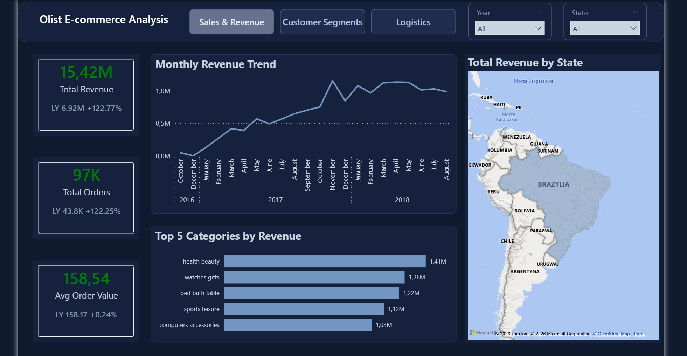
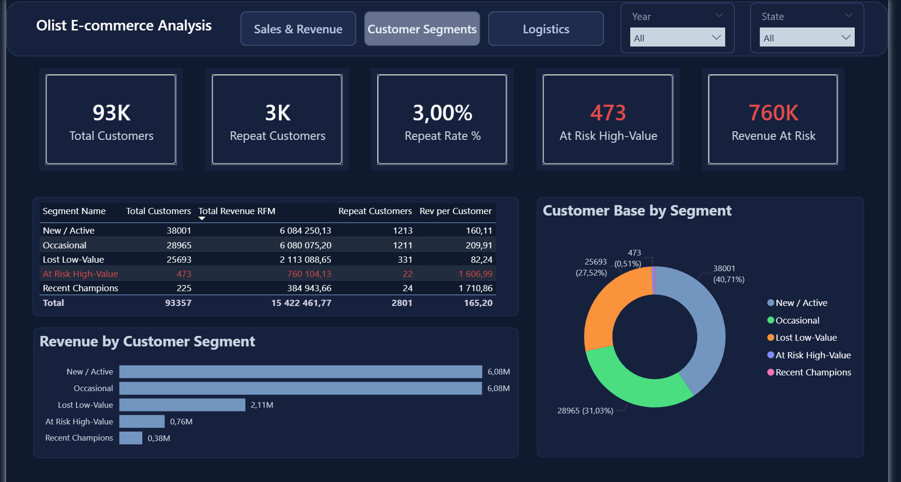

# E-commerce Analysis — Olist Brazilian Marketplace (SQL + Power BI)

✅ **Status: Complete**

Olist is a Brazilian marketplace platform connecting independent sellers with buyers — similar to how Allegro operates in Poland. This end-to-end project covers the full analytical pipeline: from raw data cleaning through SQL data modelling to interactive Power BI dashboards.

---

## 📈 Project Roadmap

| Phase | Status |
|-------|--------|
| Phase 1 — Data Cleaning & Staging | ✅ Complete |
| Phase 2 — RFM Customer Segmentation | ✅ Complete |
| Phase 3 — Data Marts (SQL) | ✅ Complete |
| Phase 4 — Power BI Dashboard: Sales & Revenue | ✅ Complete |
| Phase 4 — Power BI Dashboard: Customer Segments | ✅ Complete |
| Phase 4 — Power BI Dashboard: Logistics | ✅ Complete |

---

## 📊 Power BI Dashboards

### Dashboard 1: Sales & Revenue


Built on top of SQL Data Marts — connecting pre-aggregated data to interactive visualizations.

**Visuals:**
- KPI Cards: Total Revenue (15.42M R$), Total Orders (97K), Avg Order Value (158.54 R$) with Year-over-Year comparisons
- Monthly Revenue Trend — line chart across 2016–2018
- Top 5 Categories by Revenue — bar chart
- Total Revenue by State — Brazil bubble map

**DAX Measures:**
- LY comparisons (Total Revenue LY, Total Orders LY, Avg Order Value LY)
- YoY % growth calculations
- Conditional color formatting on KPI values (green/red)

---

### Dashboard 2: Customer Segments


Built on the RFM segmentation table — visualizing customer behavior and retention risk.

**Visuals:**
- 5 KPI Cards: Total Customers (93K), Repeat Customers (3K), At Risk High-Value (473), Repeat Rate % (3%), Revenue At Risk (760K R$) — At Risk cards highlighted in red
- Revenue by Customer Segment — bar chart
- Customer Base by Segment — donut chart
- Segment breakdown table with Revenue per Customer column — At Risk row highlighted in red via conditional formatting

---

### Dashboard 3: Logistics


Built on the logistics data mart — tracking delivery performance across Brazilian states.

**Visuals:**
- 3 KPI Cards: Avg Delivery Time (19 days), Avg Late Rate (8%), On Time Rate % (93.23%)
- Avg Late Rate by State — horizontal bar chart
- State-level performance table
- Logistics Performance by State — bubble map

---

## 💡 Key Business Insights

**Sales & Revenue**
- Total platform revenue reached 15.42M R$ across 2016–2018, with a strong peak in November 2017 — likely driven by Black Friday
- Top 5 categories (health_beauty, watches_gifts, bed_bath_table, sports_leisure, computers_accessories) generate a disproportionate share of revenue, indicating concentration risk
- São Paulo accounts for the largest share of orders — the platform is heavily dependent on one region

**Customer Segments**
- 97% of customers made only one purchase — Olist operates on a volume-driven model with very low retention
- 2,801 repeat customers identified (3% repeat rate) — hidden loyalty mostly in New/Active and Occasional segments
- 473 At Risk High-Value customers represent 4.93% of total revenue despite being only 0.51% of the customer base — a key retention target for the platform
- Occasional customers spend on average 210 R$ per order vs 160 R$ for New/Active — returning customers tend to spend more

**Logistics**
- Overall On Time Rate of 93.23% with an average late rate of 8%
- Alagoas (AL) has the highest late rate at 19% — the most challenging state for on-time delivery
- Rio de Janeiro has an On Time Rate of only 87.89% despite being the second largest market

---

## 📋 Strategic Recommendations

**Customer Retention**
- Olist should consider introducing a platform-wide loyalty programme — similar to Allegro Smart — to increase the 3% repeat rate and reduce dependency on continuous customer acquisition
- Providing sellers with re-engagement tools to target the 473 At Risk High-Value customers could recover a significant part of the 760K R$ at-risk revenue
- Studying the behaviour of the 24 repeat buyers in the Champions segment could help Olist set better standards across all sellers

**Category & Seller Strategy**
- Heavy revenue concentration in 5 categories creates risk — Olist should actively recruit sellers in underrepresented categories to diversify the product offer
- Monitoring review scores in high-volume categories can serve as an early warning signal for quality issues

**Regional Expansion**
- Over-reliance on São Paulo is a structural risk — offering reduced commission rates or better support to sellers in smaller states could stimulate growth outside the main market

**Logistics**
- As a marketplace, Olist manages the delivery process directly with logistics partners — focusing on Alagoas (19% late rate) and Rio de Janeiro (87.89% On Time Rate) through better carrier contracts or regional partnerships would improve the overall platform experience
- The strong November revenue peak should be used to prepare sellers and logistics partners ahead of the peak season

---

## 🎯 Key Technical Challenges Solved

- **Customer identity problem:** customer_id is unique per session — mapped to customer_unique_id to correctly identify 2,801 repeat buyers
- **Row inflation:** installment payments created up to 29 rows per order — resolved using COUNT(DISTINCT order_id)
- **Window function execution order:** MySQL calculates window functions after aggregation — LAG cannot reference a SUM from the same SELECT level, requiring nested subqueries
- **Revenue inflation in multi-item orders:** payment values divided by item count in sales_dashboard to prevent double-counting
- **Empty strings vs NULL:** 610 products had empty strings in category field — handled using COALESCE(NULLIF()) to preserve 1,300+ orders as 'unknown'

---

## 🛠️ Project Structure

```
02_E_commerce_Olist_Analysis/
│
├── 1_Phase_Data_cleaning/
│   ├── 01_data_cleaning.sql
│   └── Phase1_Data_Cleaning.pdf
│
├── 2_Phase_RFM/
│   ├── 02_rfm_dashboard.sql
│   └── Phase2_RFM_Segmentation.pdf
│
├── 3_Phase_Data_marts_Aggregations/
│   ├── 03_sales_trends.sql
│   ├── 04_logistic_performance.sql
│   ├── 05_sales_by_category.sql
│   ├── 06_sales_by_state.sql
│   ├── 07_sales_dashboard.sql
│   ├── 08_logistic_dashboard.sql
│   └── Phase3_Data_Marts_Summary.pdf
│
└── 4_Power_BI_Dashboard/
    ├── 01_sales_revenue.png
    ├── 02_customer_segments.png
    └── 03_logistics.png
```

---

## 📌 Data Source

Brazilian E-Commerce Public Dataset by Olist (Kaggle) — 100,000+ orders from 2016–2018.

*Project completed: April 2026*
