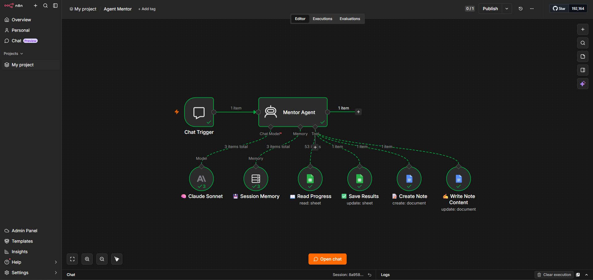

# 🤖 AI Mentor Agent

**Personalny agent AI do nauki data analytics — zbudowany w n8n bez jednej linijki kodu.**

---

## 📌 Project Overview

AI Mentor Agent is a personalized learning assistant built in n8n that helps junior data analysts consolidate their knowledge through active recall and adaptive questioning.

Instead of giving ready answers, the agent asks guiding questions — making you think before confirming or correcting your response.

---

## 🎯 Why I Built This

I completed the KajoData analytics course (Python, SQL, Power BI) and needed a structured way to consolidate 66 topics before job interviews. I also participate in the **Umiejętności Jutra AI 3.0** program (Google x SGH), which challenged me to build something practical with AI.

So I built a tool that learns *with* me — tracking my weakest topics and focusing each session where I need it most.

---

## ⚙️ How It Works

```
Chat Trigger → Mentor Agent
                    ↓
   Claude Sonnet  |  Session Memory  |  Read Progress  |  Save Results  |  Create Note  |  Write Note Content
```

1. **Session start** — agent reads progress from Google Sheets (66 topics across Python, SQL, Power BI)
2. **Topic selection** — automatically picks topics with the worst score (errors / total answers)
3. **Learning session** — adapts teaching style based on difficulty:
   - Simple questions → short explanation + follow-up question
   - Hard questions → Socratic method (guiding questions only, no direct answers)
4. **Progress tracking** — updates Google Sheets after every answer
5. **Session end** — generates a Google Docs note with topics to review

---

## 🛠️ Tech Stack

| Tool | Purpose |
|---|---|
| n8n | Workflow automation (no-code) |
| Claude Sonnet (Anthropic API) | AI model |
| Google Sheets | Progress tracking (66 topics) |
| Google Docs | Session notes generation |

---

## 📊 Topics Tracked (66 total)

| Category | Topics |
|---|---|
| Python | Lists, loops, functions, pandas, NumPy, Matplotlib, Seaborn (20 topics) |
| SQL | SELECT, JOIN, CTE, window functions, LAG/LEAD, RFM segmentation (25 topics) |
| Power BI / Excel | DAX measures, CALCULATE, Power Query, pivot tables, VLOOKUP (21 topics) |

---

## 🔑 Key Features

- ✅ Reads progress from Google Sheets at session start
- ✅ Identifies weakest topics automatically
- ✅ Adapts teaching style (simple vs hard questions)
- ✅ Updates progress after every answer
- ✅ Generates session notes in Google Docs
- ✅ Session memory — remembers context within a conversation

---

## 💡 Key Lesson Learned

Tried connecting Excel via Microsoft API — 1 hour of fighting, "ObjectHandle is Invalid" errors.  
Switched to Google Sheets — worked in 2 minutes.  
**Sometimes the simpler solution is just better.**

---

## 🔗 Links

- 💼 [LinkedIn post about this project](https://pl.linkedin.com/in/aleksandrazalecka)
- 📁 [Main Portfolio Repository](https://github.com/oleexxa/Data-Analysis-Portfolio)

---

## 📸 Workflow



---

*Built as part of the Umiejętności Jutra AI 3.0 program (Google x SGH) — June 2026*
